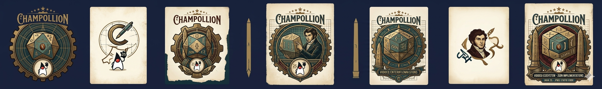

<p align="center">
  
</p>

<h1 align="center">Champollion</h1>

<p align="center">
  <strong>Jakarta JSON-P 2.1 + JSON-B 3.0 implementation — zero dependencies, static APT codegen, native JPMS</strong><br>
  <a href="https://jakarta.ee/specifications/jsonp/2.1/">Jakarta JSON-P 2.1</a> | <a href="https://jakarta.ee/specifications/jsonb/3.0/">Jakarta JSON-B 3.0</a> | Virtual Threads | JDK 25
</p>

<p align="center">
  
  
  
  
  
</p>

---

Champollion is the **Jakarta JSON Processing 2.1** and **Jakarta JSON Binding 3.0**
implementation of the [Vidocq](https://forge.vidocq.dev/vidocq) ecosystem: zero dependencies
beyond Jakarta specs, pure JDK 25, strict JPMS, virtual threads, **compile-time static binding
generation via APT** to avoid runtime reflection.

The name pays homage to **Jean-François Champollion** (1790–1832), decipherer of Egyptian
hieroglyphics — Champollion reads arbitrary structures and translates them into typed Java objects.

## Modules

| Module | Description |
| --- | --- |
| `champollion-api` | Re-exports `jakarta.json` + `jakarta.json.bind`. Custom extension point to come. |
| `champollion-jsonp` | Complete JSON-P 2.1 implementation — streaming parser/generator, object model, builders, Reader/Writer, JsonPointer (RFC 6901), JsonPatch (RFC 6902), JsonMergePatch. |
| `champollion-jsonb` | JSON-B 3.0 implementation — `toJson`/`fromJson` runtime + lookup-first via `JsonbBinding<T>` SPI. Covers primitives, `java.time`, UUID, enum, records, POJOs, containers. |
| `champollion-codegen-apt` | Pure JDK annotation processor. Generates one `JsonbBinding<T>` per record annotated `@JsonbStatic` + ServiceLoader file. Automatic static vs runtime differential. |
| `champollion-codegen-maven-plugin` | `generate` mojo that scans the compile classpath and delegates to APT for non-annotable classes (third-party POJOs). `maven-plugin-plugin 4.0.0-beta-2`, Java 25. |
| `champollion-tck` | **Out-of-reactor** (POM Model 4.0.0). Profiles `-Pjsonp-tck` (JUnit 5) and `-Pjsonb-tck` (TestNG). Clean skip (exit 78) if official TCK is absent. |
| `champollion-bench` | JMH POM ready — comparisons vs Parsson / Yasson / Jackson to come. |
| `champollion-examples` | Usage examples — to be written. |

## Philosophy (inherited from Vidocq)

- **Strict JPMS**, no classpath.
- **Class-File API (JEP 484) + APT** to generate `JsonbBinding<T>` at compile time. No runtime reflection when the static binding exists; runtime introspective fallback only for non-recompilable types.
- **Zero external dependencies** beyond `jakarta.json-api`, `jakarta.json.bind-api`. No Parsson, Yasson, or Jackson.
- **Virtual Threads** — no `synchronized`, no `ThreadLocal`. `ConcurrentHashMap` / `ClassValue` caches. Propagation via `ScopedValue`.
- **Strict TDD** — Red → Green → Refactor, RFC citations in `@DisplayName`.
- **TCK 100% PASS** as a hard contract on both JSON-P and JSON-B, in runtime mode AND in static codegen mode.

## Status

🟢 Reactor operational — `mvn install -DskipTests` ✅ on 8 modules, **290/290** unit tests green.

| Phase | Status |
| --- | --- |
| M0 — Multi-module bootstrap, JPMS, ServiceLoader | ✅ |
| M1 — JSON-P (tokenizer, parser, generator, provider) | ✅ |
| M2 — Object model + builders + Reader/Writer | ✅ |
| M3 — JsonPointer + JsonPatch + MergePatch | ✅ |
| M4 — JSON-B runtime introspective | ✅ |
| M5 — Codegen APT + Maven plugin | ✅ MVP |
| M6 — TCK 100% PASS | ✅ |
| M7 — JMH benchmarks vs Parsson / Yasson / Jackson | ⏳ planned |

Details per sub-module and phase progress: see [`STATUS.md`](./STATUS.md) and [`ROADMAP.md`](./ROADMAP.md).
Exhaustive TCK status: [`TCK.md`](./TCK.md).
Reproducible bugs: [`BUG.md`](./BUG.md). Performance measurements: [`BENCH.md`](./BENCH.md).

## Quick Start

```bash
sdk env                           # JDK 25 + Maven 3.9.16 (cf. .sdkmanrc)
mvn -ntp install -DskipTests      # reactor build (8 modules)
mvn test                          # unit tests
```

Official TCKs (non-public artifacts, must be installed in local M2):

```bash
./install-tck.sh                  # download the official Eclipse ZIPs
./run-official-tck-jsonp-2.1.sh   # JSON-P smoke test
./run-official-tck-jsonb-3.0.sh   # JSON-B smoke test
```

## Documentation

The Vidocq ecosystem's Antora site aggregates Champollion documentation (FR + EN):
[doc.vidocq.dev/champollion-fr](https://doc.vidocq.dev/champollion-fr/) ·
[doc.vidocq.dev/champollion](https://doc.vidocq.dev/champollion/).

## License

EPL-2.0 OR EUPL-1.2 OR GPL-2.0-or-later — see [`LICENSE`](./LICENSE).
